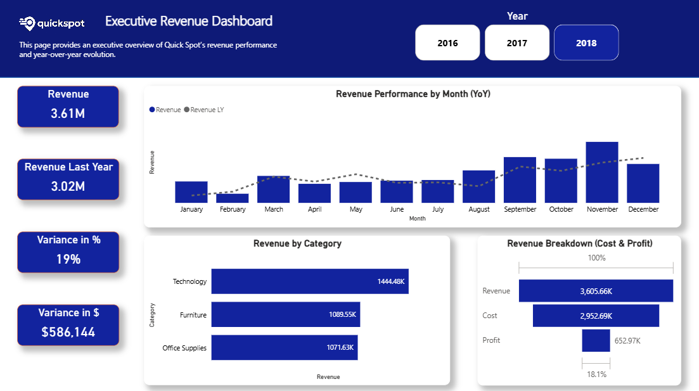
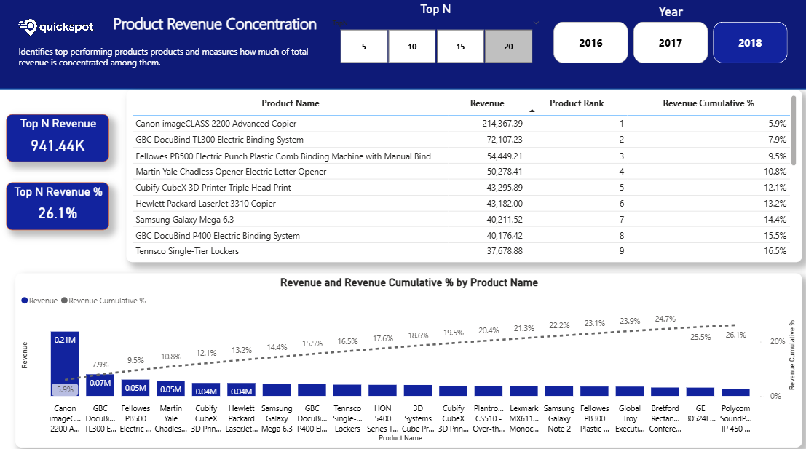
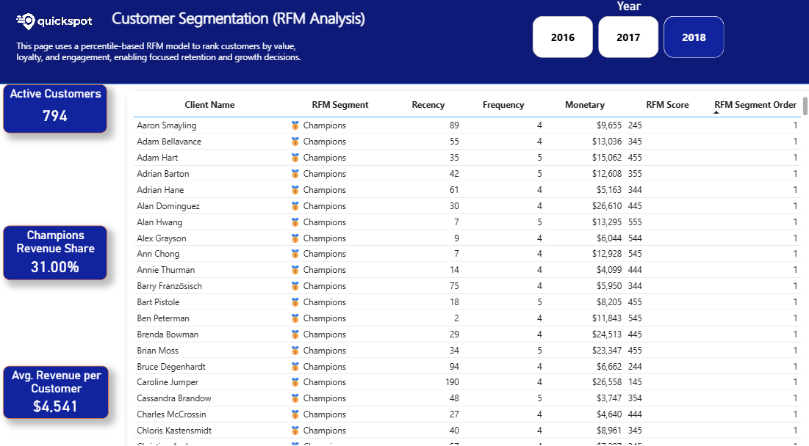

# Executive Revenue Dashboard — QuickSpot

## Project Overview
This project delivers an executive-level revenue analytics dashboard designed to move beyond static reporting and enable **prioritized, decision-ready insights**.

The dashboard is structured in analytical layers, progressing from a high-level overview to detailed analysis across products, customers, and geographies.

## Why this exists
QuickSpot has revenue data available, but leadership lacks a clear way to quickly answer:
- What is driving revenue growth?
- Which products truly matter?
- Which customer segments sustain the business?
- Where revenue is geographically concentrated?

## Dashboard Pages

### 1) Executive Revenue Overview
High-level snapshot with YoY comparison, monthly trends, category contribution, and revenue/cost/profit structure.

### 2) Products — Revenue Concentration (Pareto)
Identifies top-performing products and quantifies revenue concentration using dynamic Top N analysis.

### 3) Geography — Regional & City Performance
Analyzes revenue distribution across regions, states, and cities to support geographic prioritization.

### 4) Customers — RFM Segmentation
Segments customers using Recency, Frequency, and Monetary logic to highlight high-value customer groups.

## Key Capabilities
- Executive revenue visibility with YoY performance comparison  
- Product and category performance analysis using Pareto logic  
- Customer value segmentation using RFM  
- Geographic insights for regional prioritization  
- Clean, decision-oriented design focused on clarity  

## Tools & Skills Demonstrated
- Power BI  
- Power Query  
- DAX (time intelligence and business metrics)  
- Star schema data modeling  
- Financial and business analytics storytelling  

## Quick Links
- 📊 **Dashboard (PBIX)** — `dashboard/QuickSpot_Executive_Revenue_Dashboard.pbix`
- 📄 **Project Context** — `documentation/Project_Context.md`
- 🧠 **Methodology** — `documentation/Methodology.md`
- ✅ **Key Takeaways** — `documentation/Key_Takeaways.md`

## Author
**Juan Pablo Briceño Ramos**  
Business & Financial Analyst | Toronto, Canada  
LinkedIn: https://www.linkedin.com/in/juan-p-briceno
